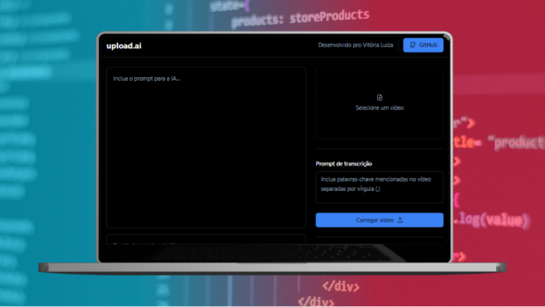

<h1>Aplicação de IA para Geração de Conteúdos Inteligentes a partir de Vídeos</h1>

A ferramenta permite que os usuários façam upload de vídeos e realizem perguntas à IA sobre o conteúdo desses vídeos. Além disso, a aplicação disponibiliza exemplos de prompts pré-definidos, como "Gere títulos para este vídeo", "Crie uma descrição para este vídeo" ou "Faça o resumo desse vídeo", para facilitar ainda mais o uso e a compreensão do potencial da IA.

<a href="https://github.com/VitoriaLuizaDeveloper/api-upload-ai">Repositório do Back-end</a>
  
